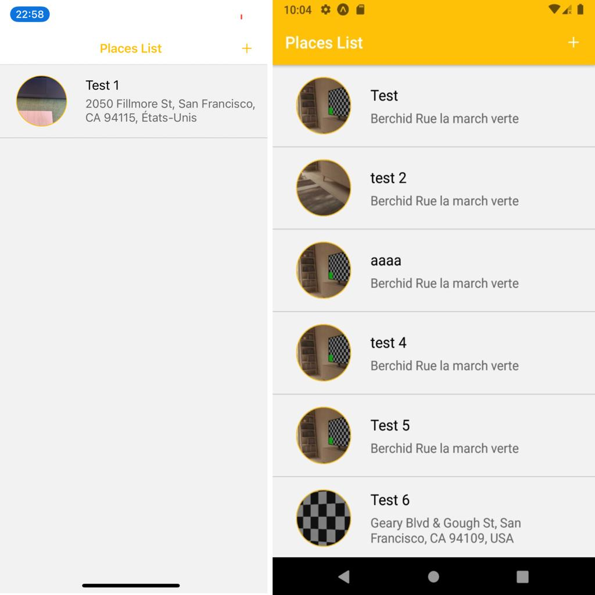
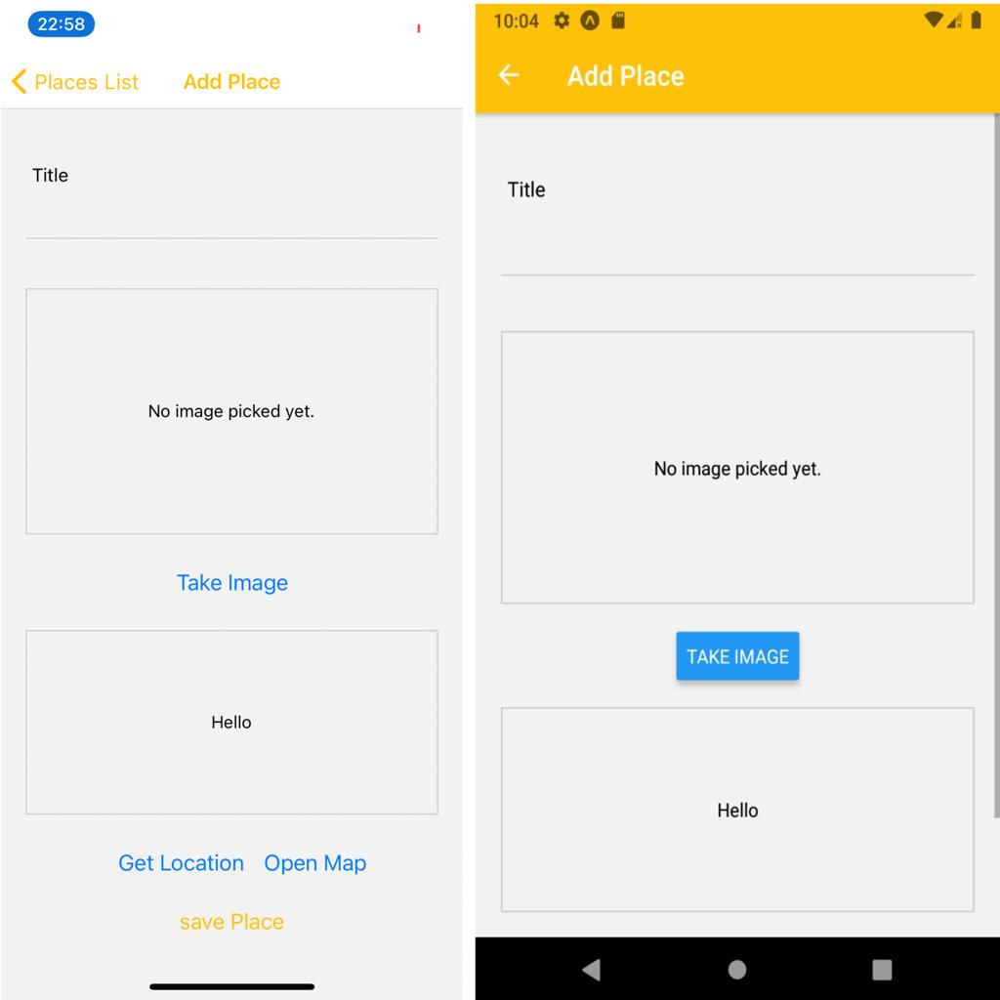
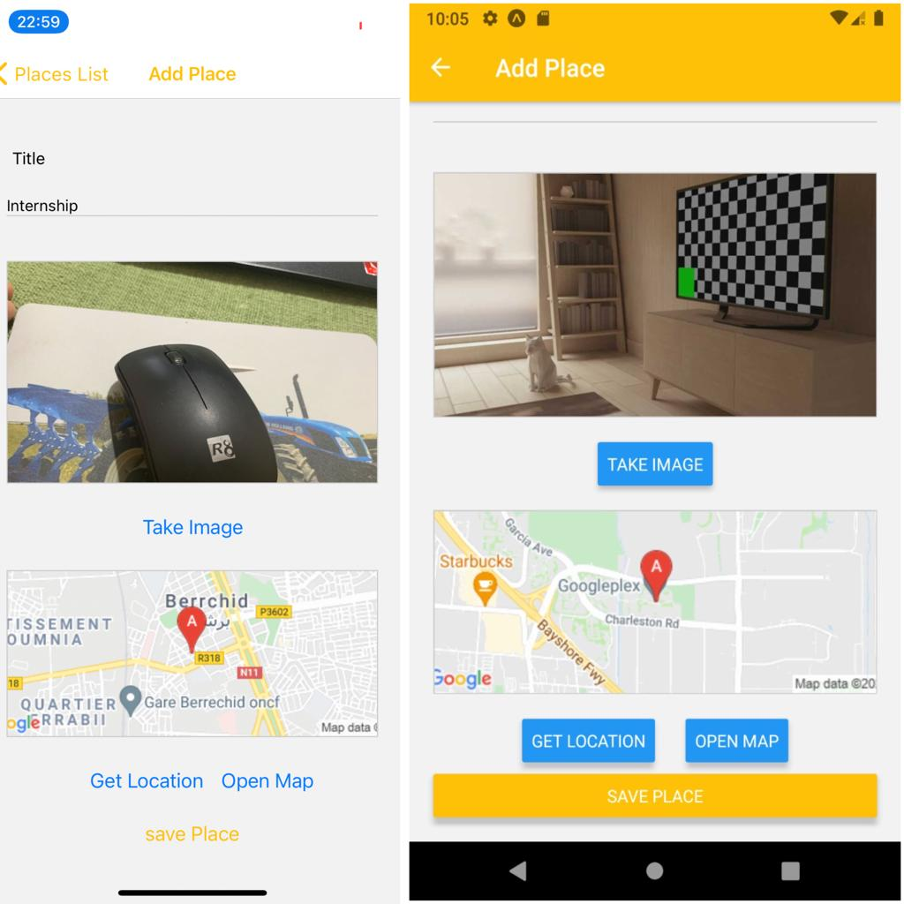
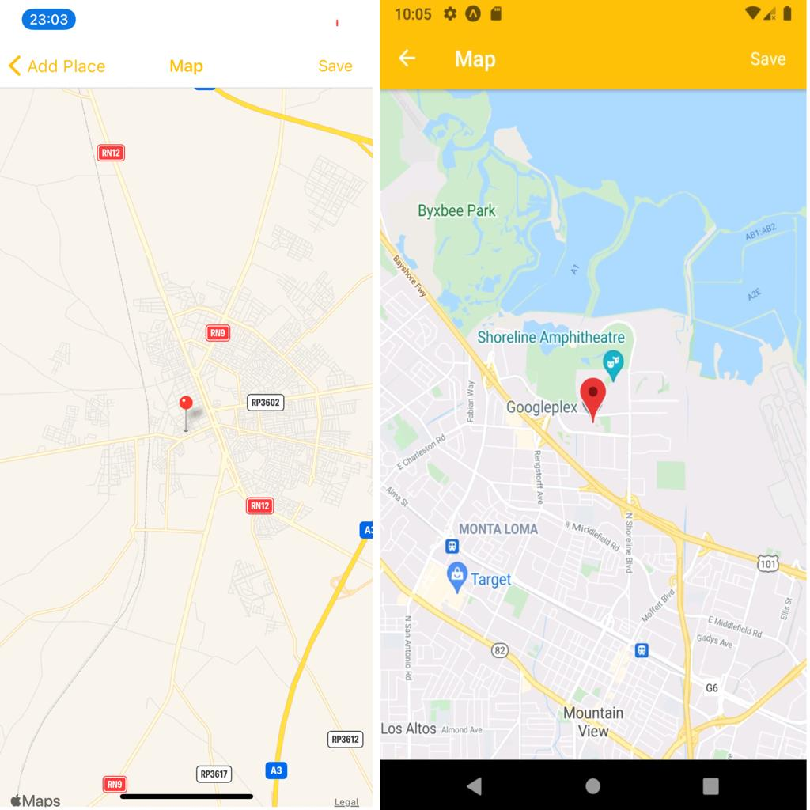
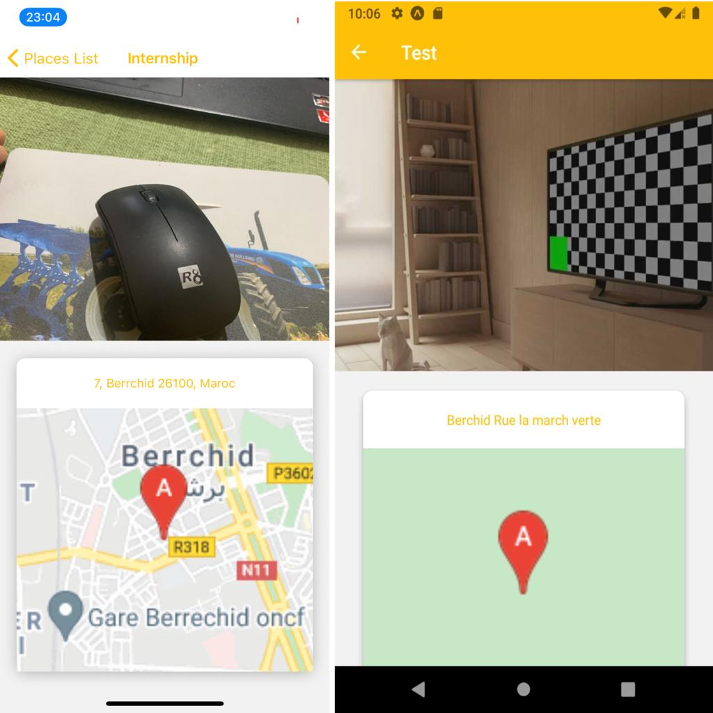

# Features

### Installation

- run `npm install` or `yarn install`

- run `npm install redux@4.1.1` or `yarn add redux@4.1.1`

- run `npm install react-redux@7.2.4` or `yarn add react-redux@7.2.4`

- run `npm install redux-thunk@2.3.0` or `yarn add redux-thunk@2.3.0`

- run `npm install react-navigation@4.4.4` or `yarn add react-navigation@4.4.4`

- run `npm install react-native-maps@0.28.0` or `yarn add react-native-maps@0.28.0`

- run `npm install expo-sqlite@9.2.1` or `yarn add expo-sqlite@9.2.1`

- run `npm install expo-location@12.1.2` or `yarn add expo-location@12.1.2`

- run `npm install expo-image-picker@10.2.2` or `yarn add expo-image-picker@10.2.2`

- run `npm install expo-file-system@11.1.3` or `yarn add expo-file-system@11.1.3`

### Run on Device

- run `yarn android` or `yarn ios` to run on device or emulator

### Project info

This project is simple example of a react native application a practice for :

-how to use SQLite to store in your phone,

-how to use features (Google Map, Camera),

-how to use Google APIs , 

-how to use navigation and navigate between screens,

-and also how to use Icons ,

-and also how to use redux (actions and reducers)

#### ScreenShots - Native App

